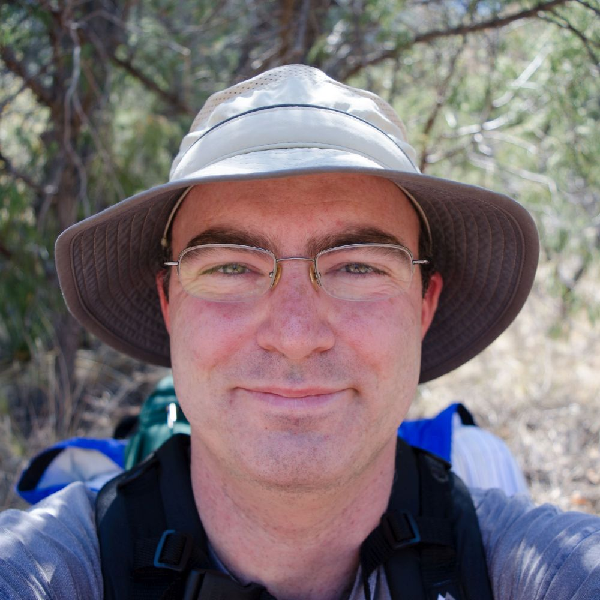
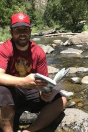

## Organizers

The Data Assimilation workshop is being organized by the folks below:

### [Michael Erb](https://www.michaelerb.org/), School of Earth and Sustainability, Northern Arizona University

### [Nick McKay](https://www.cefns.nau.edu/~npm4/), School of Earth and Sustainability, Northern Arizona University

### [Nathan Steiger](https://njsteiger.github.io/), Hebrew University of Jerusalem and Lamont-Doherty Earth Observatory, Columbia University

### [Sylvia Dee](https://sylviadeeclimate.org/), Earth, Environmental, and Planetary Sciences, Rice University

### [Chris Hancock](https://www.cefns.nau.edu/~npm4/), School of Earth and Sustainability, Northern Arizona University

## Contact

If you'd like to get in touch, please contact Michael Erb at [michael.erb@nau.edu](michael.erb@nau.edu).
